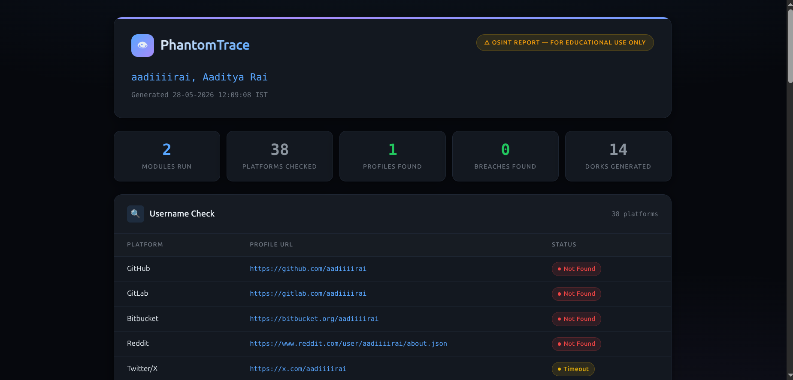

# PhantomTrace — OSINT Footprinting Tool

PhantomTrace aggregates public information for a name, username, email, image, or domain and generates a HTML report.

**Ethical use disclaimer:** This tool is for lawful, authorized security research and personal data audits only. Do not use it to target individuals, invade privacy, or violate any terms of service or laws. You are responsible for how you use it.



## Features
- Username checker across 35+ platforms (async HTTP GET with body text inspection and redirect validation to eliminate false positives).
- Email breach lookup via HaveIBeenPwned API v3.
- EXIF metadata extraction for images (GPS, device, timestamps).
- WHOIS lookup for domains.
- Google dork generator (opens searches in browser).
- HTML report generation (Jinja2, dark theme).

## Setup
```bash
python -m venv venv
source venv/bin/activate
pip install -r requirements.txt
```

Create a `.env` file from the sample:
```bash
cp .env.example .env
```

Fill in your HaveIBeenPwned API key and user agent in `.env`.

## Usage
```bash
python main.py --username johndoe --email johndoe@example.com --domain example.com --image samples/photo.jpg --dork "John Doe"
```

Run multiple modules with `--all` (only those with inputs provided will execute):
```bash
python main.py --all --username johndoe --email johndoe@example.com --domain example.com
```

## Folder Structure & Output

### Folders
- **`samples/`**: Put local target files (e.g. photos/images for EXIF extraction) here for scanning. The contents of this folder are ignored by Git (`.gitignore`) to keep your target files private.
- **`output/`**: The generated HTML reports are written here. Like `samples/`, its contents are ignored by Git.

### Report Name Format
Unless an output path is explicitly provided via the `--output` parameter, the report is automatically saved in `output/` with a dynamic filename based on the scan inputs:
- **If Username is checked**: `report [username: <username>].html`
- **If Email is checked (and no username)**: `report [email: <email>].html`
- **If Domain is checked (and no username/email)**: `report [domain: <domain>].html`
- **If Dork target is checked (and no username/email/domain)**: `report [name: <dork_query>].html`
- **Fallback**: `report.html`
